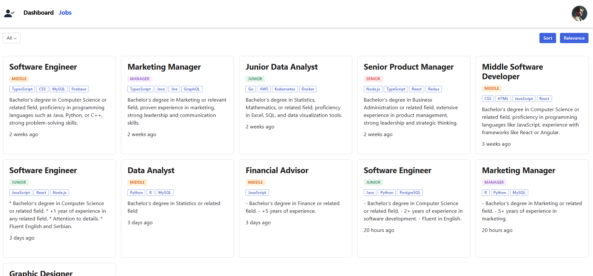
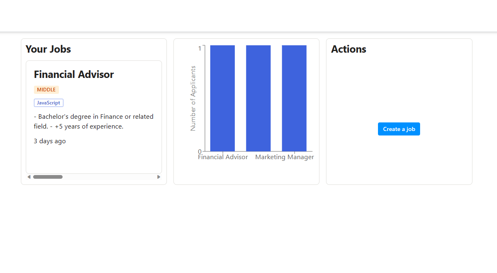
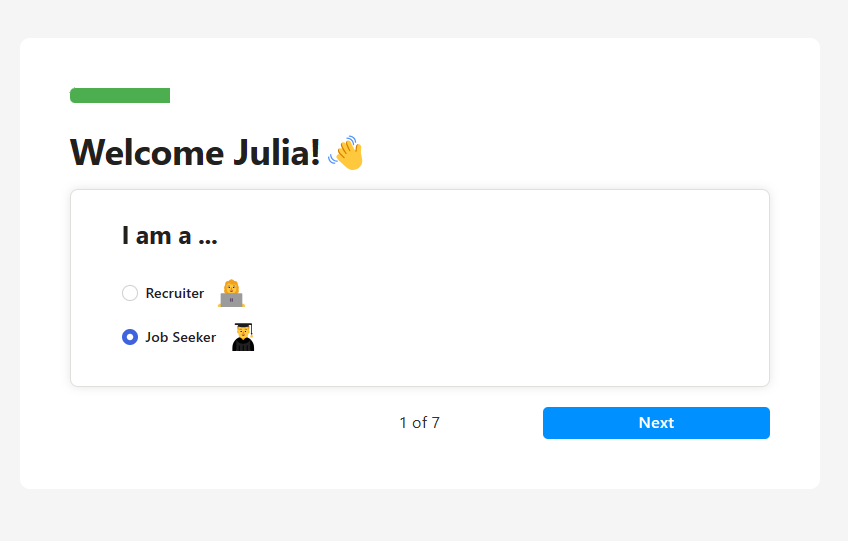

# Job Board App

This job board application is built using Next.js, TypeScript, and MongoDB. It allows users to apply for jobs with their resumes, and recruiters to create job listings and review candidate applications, manage profiles, and implementing role-based authentication using NextAuth.



## Features

- Role-based authentication using NextAuth for users and recruiters.
- Users can apply for jobs by submitting their resumes with Uploadcare.
- Create, edit, and manage user profiles.
- Recruiters can create and manage job listings.
- Email confirmation sent to users upon applying for a job with resend.
- Recruiters have bar charts for their posted jobs status.

## Tools

- Rechart: used to show a bar chart for recruiters with their posted jobs and number of candidates applied for each one.



- react-hook-form: used to manage forms and register input fields.



## Technologies Used

- Next.js
- TypeScript
- MongoDB
- RadixUI
- TailwindCSS
- NextAuth

## Installation

1. **Clone the repository**

   ```bash
   git clone https://github.com:Mo-21/job-board.git
   ```

2. **Install dependencies**

   ```bash
   cd job-board-app
   npm install
   ```

3. **Start the development server**

   ```bash
   npm run dev
   ```

4. **Open the app in your browser**
   The app should be running at http://localhost:3000.

## Usage

- As a user:

  - Sign up or log in using NextAuth.
  - Complete your profile details.
  - Browse job listings and apply for jobs by uploading your resume.

- As a recruiter:

  - Sign up or log in using NextAuth as a recruiter.
  - Create job listings and manage candidate applications.
